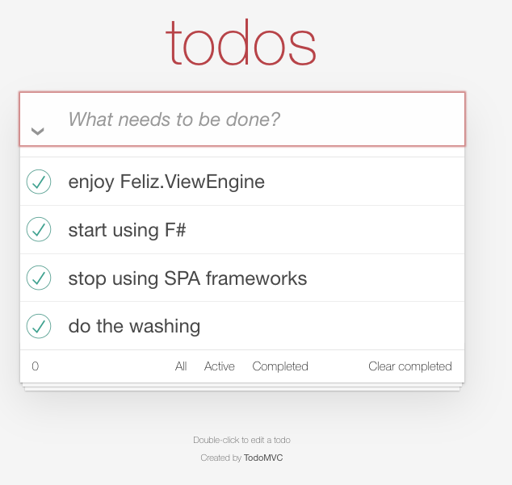

# [TODO MVC](https://todomvc.com/) Feliz.HTMX




 app in [F#](https://dotnet.microsoft.com/en-us/languages/fsharp) + [Feliz.ViewEngine.HTMX](https://github.com/Zaid-Ajaj/Feliz.ViewEngine.Htmx) and [HTMX](https://htmx.org/) library, implemented as a single `.fsx` fsharp interactive script.

Inspired by [TODO MVC HTMX](https://github.com/rajasegar/todomvc-htmx) still have to finalize the implementation.

 So it's essentially a full-stack app in 1 file :) more or less.

## How to run

```
dotnet fsi program.fsx
```

## troubleshooting

If you have aspnetcore assembly load issues, try to regenerate the runtime-scripts folder, 
and reference the correct one for your machine depending on what you are currently running on

```
dotnet fsi generateScript.fsx
```

then check the `#load` statement at the beginning of `program.fsx`
